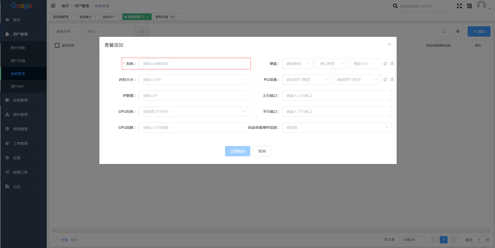
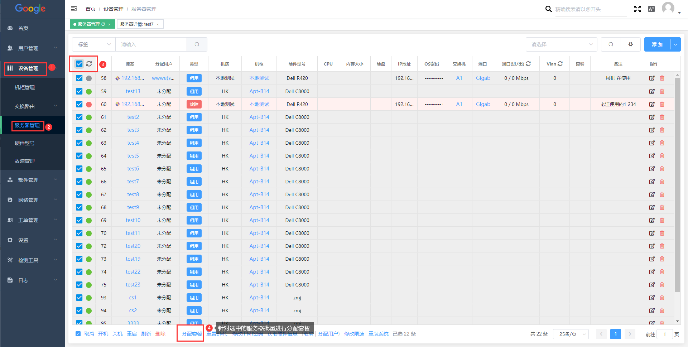

# 使用对接

WHMCS插件用于**TopLink-DCIM系统对接WHMCS**，实现自动化管理，如whmcs自动开通，删除服务器，开机、关机、重装等管理。

支持whmcs版本为 **whmcs6.x ** && **whmcs7.x **&& **whmcs8.x**

## WHMCS插件安装方法

 将我们提供的Toplink-DCIM插件上传到WHMCS网站的根目`/module/server/`中，之后进行解压即可。

## Toplink-DCIM 服务器管理系统中的设置

### 对接API生成与设置

#### 设置API

 请前往DCIM系统>>设置>>系统API>>添加

:::tip
**标签：**可以随意设置，建议使用whmcs或者是前台网站名称。  
**IP地址：**填写whmcs所在服务器的使用IP，我们仅允许该ip地址访问我们的api。
:::

之后会生成随机的**KEY** 和 **secret** 。请妥善妥善保管此 **KEY** 和 **secret**。

### 服务器套餐管理与设置

 为了实现服务器的自动开通，需设定服务器套餐，用于无人值守。

 #### 设置套餐

 前往DCIM>>用户管理>>套餐管理>>添加

 

添加时套餐名称为必选项，其余为可选选项，用于套餐的详细记录。

#### 绑定套餐

设置完成套餐之后需将服务器绑定其套餐才可实现后台无人开通。 这边提供两种绑定套餐的方法。

**方法1：**DCIM>>设备管理>>服务器管理>>选择一台服务器>>进入到服务器详情页>>分配信息>>套餐

**方法2：**DCIM>>设备管理>>服务器管理>>批量选择服务器>>分配套餐

### WHMCS 系统对接与设置

通过whmcs预留的server module原生方式对接至whmcs，使用whmcs原生产品设置和配置选项进行产品的价格定义。

#### 添加服务器

请前往WHMCS>>系统设置>>产品服务>>服务器设置>>添加新的服务器

:::info **必填字段**

**NAME（名称）：**DCIM配置。   
**Hostname （主机名）：**填写DCIM的域名或ip地址。  
**Ip（IP地址）：**填写DCIM的ip地址。
**Type（类型）：**选择Toplink DCIM。  
**Username（用户名）：**dcim系统上生成的key。  
**Password（密码）:** dcim 系统上生成的secret。  
**用户名前缀：**可填写dcim平台名称，便于用户识别。  
**WHMCS 主机名格式：**一般可填写{label}-{ipv4} 即 显示为“主机名-IP” 。  
**勾选SSL：**端口默认为443，如有变更dcim访问端口，请填写dcim端口。若无ssl则不需要进行勾选。  

:::

填写好之后可以可以点击测试连接，若显示连接成功即是与DCIM api 对接完成---如下图

#### 添加服务器分组

 前往WHMCS>>系统设置>>产品服务>>服务器设置>>创建新的分组

#### 分配服务器至分组

#### 添加产品

前往>>系统设置>>产品/服务>>产品/服务>>新增产品

:::info

**产品类型：**独服/VPS。  
**产品组：**填写已经建立的产品组名称。  
**产品名称：**服务器产品型号等（可自定义内容）。  
**模块：**模块名称- Toplink DCIM。  
**创建为隐藏:**OFF  

:::

:::info 
**当收到客户首付款时自动开通：**选中之后即可设置自动开通
:::

:::info
**定价：**可为产品设置价格以及付款周期。  
:::

