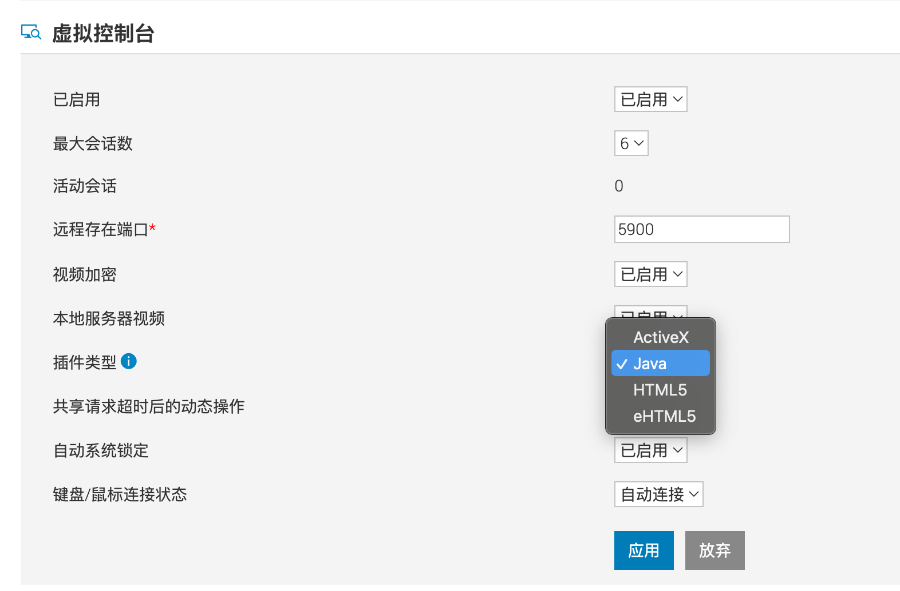

# iDRAC 9

## 添加服务器时, 显示 IPMI 无法连通
该问题通常出现在全新机器, 按下图所示操作打开所需选项即可

1. 进入 iDRAC 9 Web 管理界面, 并登录
2. 按下图所示, 点击顶部菜单栏中的 [iDRAC 设置]

3. 在 [iDRAC 设置] 页面中, 点击 [连接性]
4. 在 [连接性] 选项卡中, 按顺序点击 [网络] => [IPMI 设置]
5. 在 [IPMI 设置] 区域中, 将 [启用 LAN 上的IPMI] 更改为 [已启用]

6. 点击 [应用] 进行保存
7. 再次添加服务器测试是否正常

## VNC 控制台无法打开
该问题为控制台方式选择错误导致, 目前 DCIM 仅支持 Java 方式进行连接虚拟控制台

1. 进入 iDRAC 9 Web 管理界面, 并登录
2. 按下图所示, 点击顶部菜单栏中的 [配置] => [虚拟控制台]

3. 在 [虚拟控制台] 页面中, 将 [插件类型] 修改为 [Java]

4. 点击 [应用] 进行保存
5. 测试 VNC 控制台是否正常打开