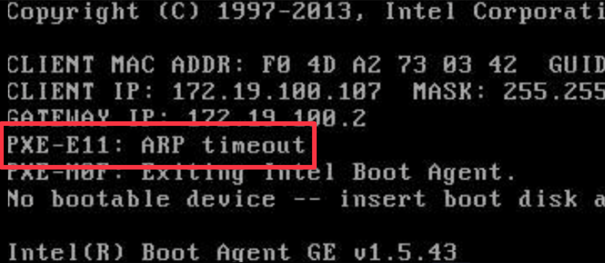

# PXE-E11: ARP timeout

## 检查方案

### 从交换机方面检查
- 检查端口管理状态
    - 解决方案: 启用端口
- 检查端口连接状态
    - 解决方案: 检查网线 / 跳线 / 模块
- 检查端口 ARP 绑定
    - 解决方案: 取消 ARP 绑定
- 检查端口 ACL 策略
    - 解决方案: 取消 ACL 策略
- ARP 老化策略 (ARP 表 IP <=> MAC 不匹配)
    - 解决方案: 忘记相关 ARP 表条目
- 如果启用了内网安装
    - 检查 VLAN trunk 是否配置正确
        - 解决方案: 加入内网 VLAN 到相关端口中 (如上联口s)

### 从服务器方面检查
- 端口连接状态
    - 解决方案: 检查网线 / 跳线 / 模块
- 网卡 MAC 地址与平台录入的是否正确
    - 解决方案 1: 从端口刷新服务器 MAC
    - 解决方案 2: 在修改服务器页面, 将正确的服务器 MAC 地址填入并保存