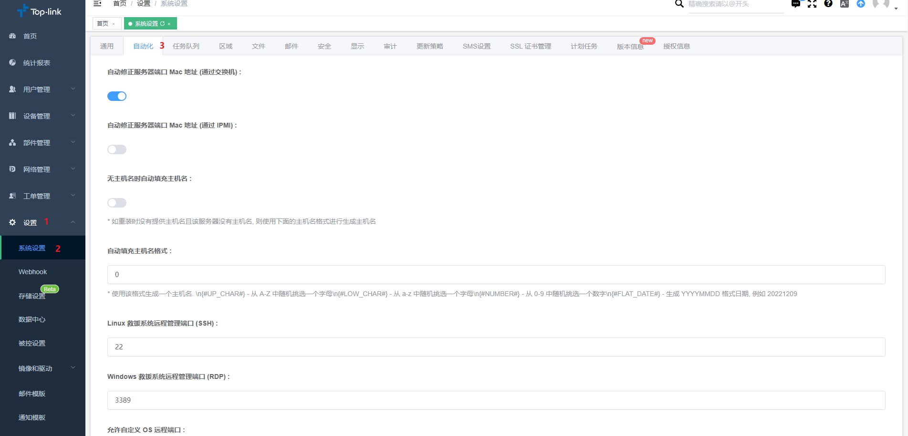
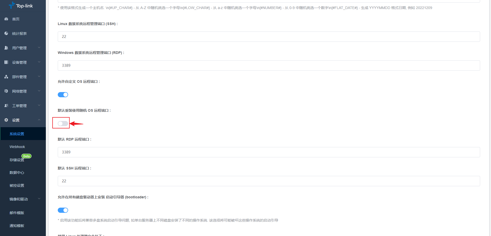

# 安装系统时设置随机远程端口

DCIM导航栏>>设置>>系统设置>>自动化

在自动化标签栏，页面下滑，会看到关于远程端口的设置项，选择**[默认重装使用随机OS远程端口]**如下图所示。

:::info  **字段说名**

**允许自定义OS远程端口： **开启之后即允许在发起系统安装时可以进行指定设置远程端口。  
**默认重装时使用随时OS远程端口：**开启之后即在系统安装时会随机生成远程端口。  
**默认RDP远程端口：**可以设置win系统安装完成之后默认的远程端口。  
**默认SSH远程端口：**可以设置linux系统安装完成之后默认的远程端口。  

:::

:::tip
🎉 设置远程端口时，随机生成OS远程端号的优先级要高于默认端口号哦。
:::