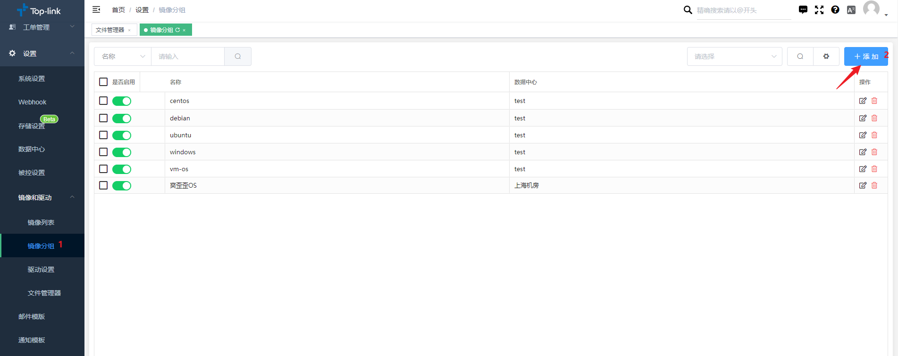

# 系统添加使用

- ## 上传镜像
  
  DCIM导航栏>>设置>>镜像和驱动>>文件管理器  

上传镜像可以是本地“上传镜像”，也可以是“远程下载”。本地上传镜像具体如下。  

  
  
选择完具体的镜像文件之后，需要进行选择同步到具体的被控，同时也是可以进行同步时的限速限制，便于控制同步时的带宽资源消耗情况。

同步镜像完成之后，我们即可进行新建镜像分组。  

- ## 新建镜像分组

DCIM导航栏>>设置>>镜像和驱动>>镜像分组  

在此页面是可以进行自定义添加**镜像分组**名称，便于镜像的管理和定制镜像的规划。

添加进行镜像分组时，可进行自定义镜像名称，以及关联指定的数据中心，如下图所示。  

- ## 新建镜像列表
  
-  ### 添加在线镜像列表
   
DCIM导航栏>>设置>>镜像和驱动>>镜像列表>>在线安装  

添加在线镜像列表时，因win内核不支持在线安装，所以在线安装只支持所有linux内核系统。

:::info 必填项字段介绍

**系统名称：**便于镜像管理和客制化镜像规划以及维护。   

**发行版：**便于快速查找Linux系统内核的系统分类。目前以支持的系统分类有CentOS / AlmaLinux / RockyLinux / 
Ubuntu / Debian / Proxmox / FreeDSB / EXSI / XenServer 等各类Linux内核镜像。  

**镜像源地：**可填写官方镜像源地址，或者是国内各大厂商镜像源地址。  

**镜像分组：**可将镜像关联指定分组，便于安装系统时快速查找选择镜像。  

**语言：**可设置待安装系统时的语言。  

**时区：**可进行预设待装系统的时区。  

:::

-  ### 添加本地镜像列表
  
  DCIM导航栏>>设置>>镜像和驱动>>镜像列表>>本地镜像安装  

本地镜像列表支持win内核各版本以及Linux内核各个版本，根据文“件管理器”中上传的镜像文件进行添加本地进行安装列表。具体如下图所示。

:::tip

**系统镜像：**选择通过“文件管理器”上传的本地镜像。  

**系统秘钥：**windows 镜像在安装过程中需要涉及到对应的系统秘钥，需要将其填写到框内。

**硬件型号：**可将添加的系统关联不同的硬件型号，便于特定硬件定制系统的管理。
:::