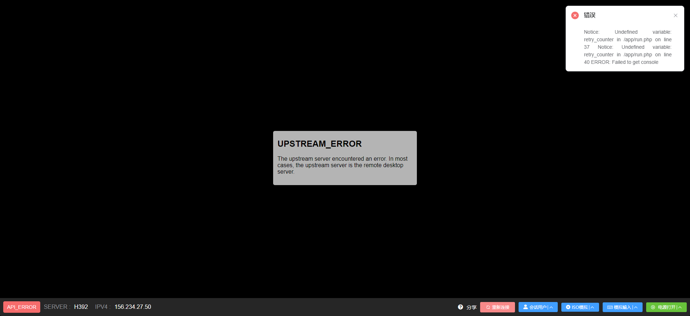
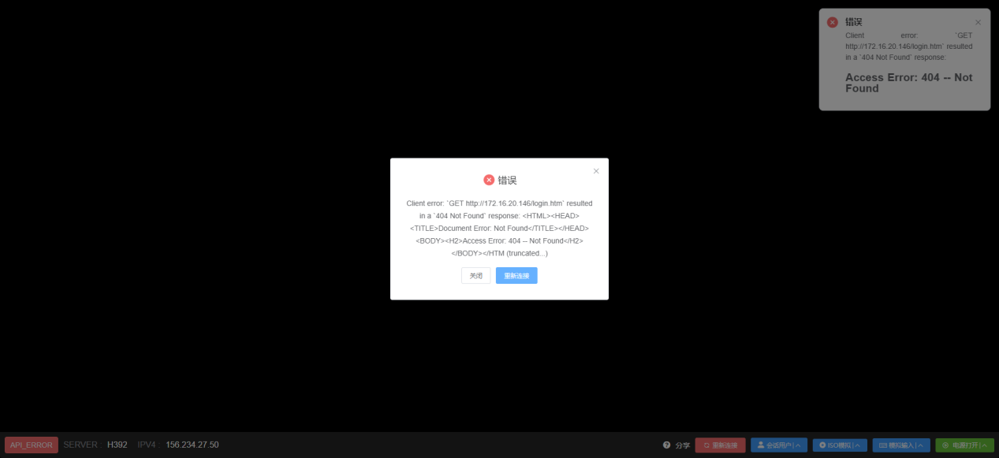
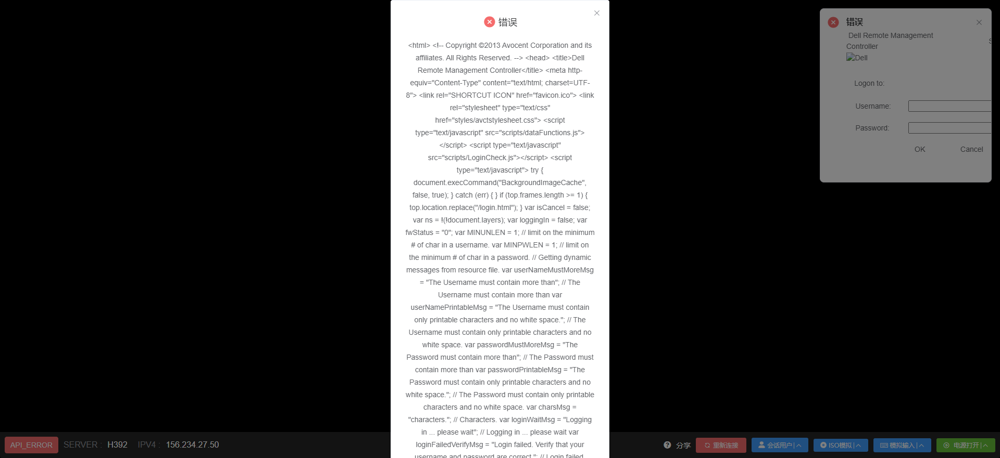
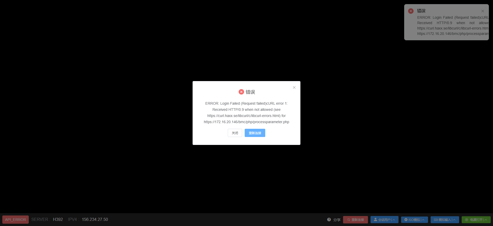
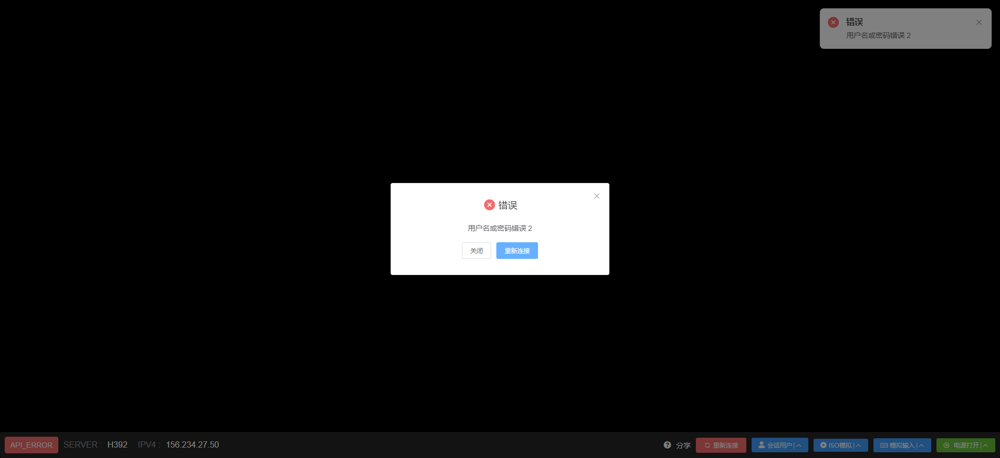
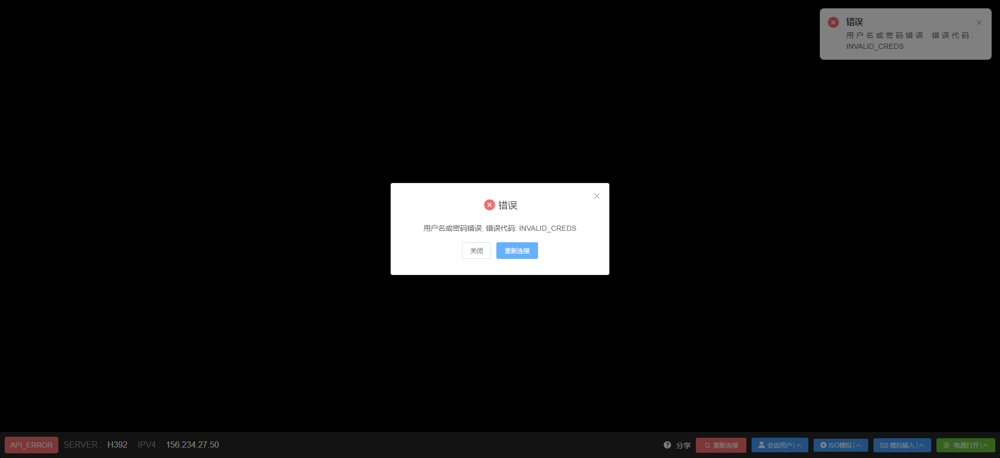

# VNC 连接报错

在点击VNC时，可能出现以下报错内容。

当出现类似报错时，检查硬件型号的KVM类型是否与实际型号匹配，若KVM类型选择错误则进行修正即可。

如果不确定具体的KVM类型，则可以将KVM类型设置为**自动检测**。

# VNC 界面提示用户名密码错误

如图所示

- 检查账号密码是否错误，是否有多余的空格。
  
- 如密码有特殊字符，请联系我们检查是否被自动转义。